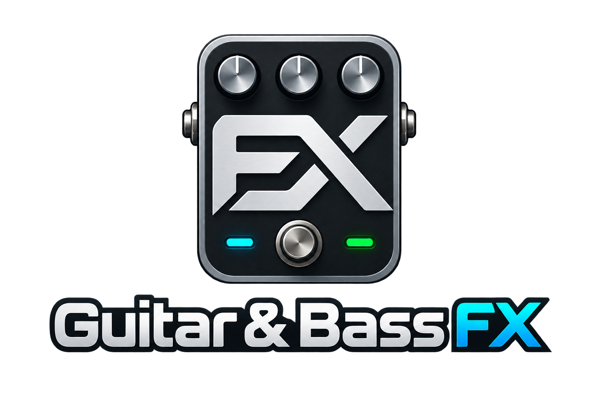

# Guitar & Bass FX

Elektro, akustik, klasik gitar ve bas için geliştirilen telefon, tablet ve bilgisayar uygulaması.

Bu depo kullanım bilgileri ve **herkese açık kurulum sürümleri** içindir. Kaynak kod ayrı, gizli depoda tutulur.

## Windows

[Son Windows sürümü](https://github.com/DKDodo/Guitar-Bass-FX/releases/latest)

ZIP'i bir klasöre çıkarıp `BasSahnePC.exe` ile aç. Java ayrıca kurulmaz. Masaüstü kısayolu ve uygulamanın görünen adı **Guitar & Bass FX**'tir. Teknik çalıştırılabilir dosya adı önceki sürümlerle uyumluluk için korunur.

**Güncellemeler** düğmesi yeni Windows sürümlerini kontrol eder, indirir ve dosyaları doğruladıktan sonra geçişi başlatır. Açılıştaki otomatik denetim kapatılabilir. Kaydedilmemiş pedalboard için kayıt seçimi sunulur; önceki uygulama ve kayıt dosyaları korunur.

## Mevcut önizleme

- Dört enstrüman profili ve altı yuvalı yerel pedalboard düzenleme.
- Kısa synth ses örnekleri.
- Manuel başlatılan kromatik akort: nota, Hz, sent, pes/tiz göstergesi.
- Windows için GitHub güncellemeleri.
- Android telefon ve tablet ekranlarına uyarlanan arayüz.

Bu bir geliştirme önizlemesidir. Gerçek bas/ses kartı ölçüm doğruluğu ve sahne kabulü henüz tamamlanmadı. Canlı altı pedal zinciri, amfi/kabin motoru, gerçekçi piyano/saksafon/klarnet dönüşümü, üyelik ve telefonla eşitleme sonraki geliştirme adımlarıdır.

## İsim geçişi

Proje adı **Guitar & Bass FX** olarak seçildi. Önceki BasSahne 0.3 Windows kurulumları, mevcut güncelleme adresinden uyumlu 0.4 geçiş paketini alabilir. Sonraki sürümler yeni yayın deposundan gelir. Uygulama kimlikleri, dosya biçimi ve kayıt klasörleri bu geçişte korunur.

## Gizlilik

Sürüm denetimi ve indirme GitHub'a bağlanır; ses veya pedalboard içeriği gönderilmez. Uygulamada GitHub hesabı/parolası gerekmez. Normal internet bağlantısı bilgileri GitHub hizmetlerine ulaşır. SHA-256 ve boyut kontrolü dosya bütünlüğünü doğrular; bağımsız Windows kod imzası değildir.

Android, Windows güncelleme kanalı üzerinden kurulmaz. Google Play yayını henüz yapılmadı.
